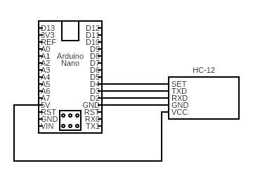
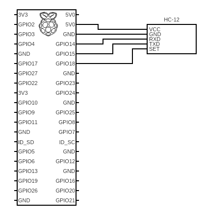
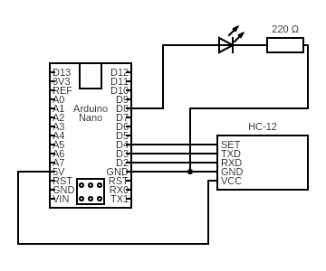

Sensor Module
=============

Serial Reader
-------------

A simple helper arduino program that sets the HC-12 module into command mode and forwards commands through the arduino to the module. 

To use
* Connect pin 2 on the arduino to the RX pin on the HC-12
* Connect pin 3 on the arduino to the TX pin on the HC-12
* Connect pin 4 on the arduino to the SET pin on the HC-12
* Connect the GND pin on the arduino to GND on the HC-12
* Connect PWR on the VCC to the arduino +5v pin



Upload the SerialWriter code the arduino and open the Serial Monitor (Tools -> Serial Monitor).

Enter the command to send to the HC-12 and click send, eg, entering AT+V will return the firmware of the HC-12.

If you see garbled text, you may need to change the baud rate of the terminal down to 1200bps.

```
www.hc01.com HC-12 v2.6
```

HC-12 Settings
--------------

We will need to configure the HC-12 modules transmission and recieve settings. The HC-12 stores its settings on a onboard memory, so this only needs to be done once. Both the sender and reciever module need to be configured identically. 

The HC-12 datasheet (https://opencircuit.shop/resources/file/0f8d974f31fd813604c4d3fb0e9004ec3b483706466/HC-12-Datasheet.pdf) gives full details on the settings avaliable. 

In the UK, the 433MHz unlicenced band is resticted to 10mW of power. The HC-12 can go up to 100mW.

From the datasheet, the HC-12 has 8 power levels, from 0.8mW up to 100mW power. The default is the full 100mW power setting.  To keep within 10mW I can use power levels 1 - 4. 

In addition the module has 4 transmission modes that affect its range and the over the air bandwidth. These are FU1 - FU4, with FU8 being the default. 

* FU1 - Short range - 100m, moderate power savings (3.6mA at idle), max bandwith 236kbps
* FU2 - Extreme power saving, 100m range, 80uA at idle, max bandwidth 4800bps
* FU3 - The default, upto 1000m range, 16mA at idle, max bandwidth 236kbps
* FU4 - Long range mode, 16mA idle, but low bandwidth 1200bps only

In general, the lower the transmitting bandwidth, the greater the range. The greater the power setting, the greater the range. 

For my use case, with the transmitter running on battery power, I want to transmit power as low as possible. As communication is one way, idle power is not a concern as I'll power down the transmitter when not required. The distance between the transmitter and sensor is only 20 metres. however the are a number of walls the signal needs to go through. 

Putting the HC-12 to sleep mode uses just 22uA (AT+SLEEP).

To test the best settings for the distance required, I created a Python script that ran on the Pi, and broadcasts on a 3 second frequency, see _utils/rangetest/broadcast.py_



I hooked up an LED to the arduino on pin 8, with a 220 ohm resistor inline and coded the arduino to flash the LED for 1 second when it recieved a valid message. This allowed me to place the Pi in its final location and by powering the arduino from a battery pack walk around to determine the range. The code for this is in _utils/rangetest/arduino_reciever.ino_ 



Experimentation has shown that the following work best for me:

* FU4 for transmission reliablity
* 1200bps (required for FU4)
* Channel 1 was fine
* Power level 3 (3.2mW)

Running AT+RX on the serial console returns: 

```
OK+B1200
OK+RC001
OK+RP:+05dBm
OK+FU4
```


Credits
-------

Circuit diagrams created with: https://www.circuit-diagram.org/editor/

